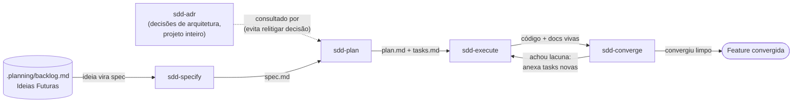
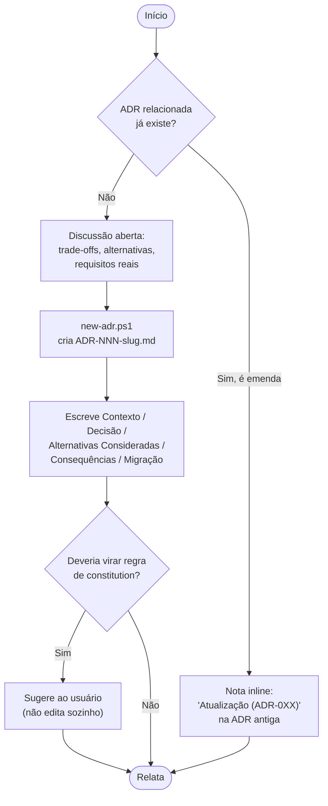
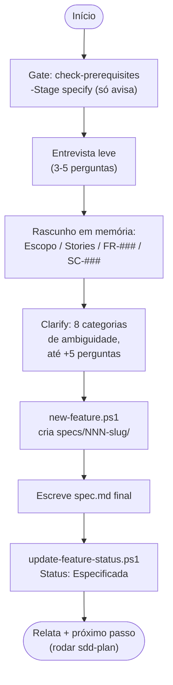
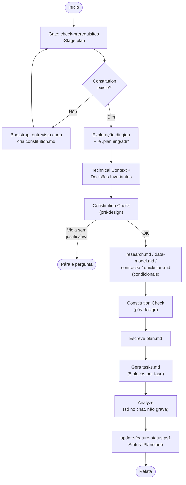
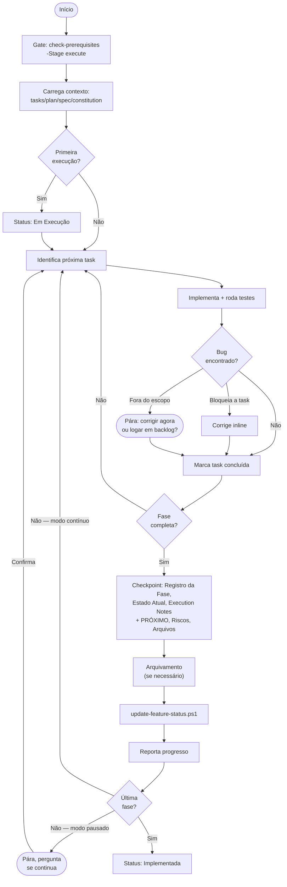
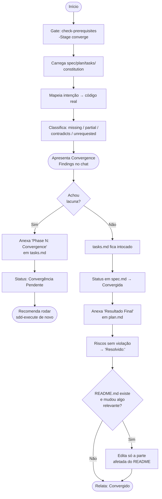

# Sistema SDD (`sdd-adr` + `sdd-specify` → `sdd-plan` → `sdd-execute` → `sdd-converge`)

Sistema próprio de Spec-Driven Development, evoluído do skill `plan-feature`
usando ideias estruturais do GitHub spec-kit (constitution como gate, spec
separada de plano separada de tasks, tasks por user story). Corrige quatro
lacunas que o `plan-feature` original tinha: dificuldade em planos grandes
(resolvida separando spec/plan/tasks/history), documentação que ficava pra
trás do código (resolvida com atualização estrutural a cada checkpoint),
falta de um backlog (resolvida com `.planning/backlog.md`), e falta de um
lugar pra registrar decisões arquiteturais fundamentais do projeto, com
alternativas rejeitadas e consequências assumidas, feitas antes ou entre
features (resolvida com `sdd-adr` + `.planning/adr/`).

Este documento explica como usar o sistema, o que cada peça faz, como a
documentação se mantém viva, e como retomar trabalho entre sessões.

## 1. Passo a passo de uso

Não existem comandos de linha de comando pra digitar — os 5 skills são
invocados em **linguagem natural**. O Claude Code reconhece qual skill usar
pela descrição de cada um.

0. **Decidir arquitetura** (opcional, tipicamente antes da primeira feature):
   "documenta essa decisão de arquitetura" / "vamos decidir e registrar qual
   banco de dados usar" → dispara `sdd-adr`. Produz
   `.planning/adr/ADR-NNN-slug.md`. Não faz parte da pipeline de uma feature
   — pode rodar a qualquer momento, inclusive antes de qualquer `specs/`
   existir.
1. **Especificar**: "especifica a feature de X" / "cria uma spec pra X" →
   dispara `sdd-specify`. Produz `specs/<NNN-slug>/spec.md`.
2. **Planejar**: "planeja essa spec" / "desenha a arquitetura da feature
   <NNN>" → dispara `sdd-plan`. Produz `plan.md` + `tasks.md` (+ artefatos
   condicionais). Lê `.planning/adr/` na exploração, se existir.
3. **Implementar**: "implementa a feature <NNN>" / "continua a feature X" →
   dispara `sdd-execute`. Constrói o código, mantendo a documentação viva.
4. **Convergir**: "checa se a feature <NNN> está completa" / "converge a
   feature X" → dispara `sdd-converge`. Fecha o ciclo, aponta lacunas ou
   sincroniza o status final.

Recomendado: até você ganhar confiança de que a invocação automática está
acertando o skill certo, prefira pedir de forma explícita por etapa
("especifica...", "planeja...", "implementa...", "converge...", "documenta
essa decisão...") em vez de frases genéricas tipo só "trabalha nessa
feature".

## 2. Fluxo de cada skill

### Visão geral (macro)

`sdd-adr` não faz parte da pipeline linear — roda a qualquer momento,
tipicamente antes da primeira feature (discussão de arquitetura inicial) ou
sempre que uma decisão fundamental precisa ser tomada/revisitada. Os outros
4 formam o ciclo de vida de uma feature específica, do início ao fechamento.

### `sdd-adr`

Independente da pipeline de feature — não exige nenhuma `specs/` existente.

| Etapa | O que faz |
|---|---|
| 1. Confere ADRs existentes | Se a discussão se relaciona a uma ADR já registrada, é emenda, não ADR nova |
| 2. Discussão aberta | Trade-offs técnicos reais — mais livre que a entrevista do `sdd-specify`, não é um checklist fixo |
| 3. Nova ou emenda? | Decide o caminho a seguir |
| 4a. Cria a ADR | `new-adr.ps1` → `.planning/adr/ADR-NNN-slug.md`; Status/Contexto/Decisão/Alternativas Consideradas (com motivo concreto de rejeição)/Consequências/Caminho de Migração |
| 4b. Emenda | **Nunca reescreve** a ADR antiga — adiciona nota inline `**Atualização (ADR-0XX):** ...` no ponto afetado; cria ADR nova só se a emenda for substancial |
| 5. Considera promoção | Pergunta se a decisão deveria virar `Restrição do Projeto` na constitution (a maioria não precisa) |
| 6. Relata | Caminho salvo, se emendou algo, se recomendou promoção |

**Artefatos**: `.planning/adr/ADR-NNN-slug.md`, e possivelmente uma nota
inline numa ADR anterior.

**Diagrama interno**:

### `sdd-specify`

| Etapa | O que faz |
|---|---|
| 1. Gate | `check-prerequisites.ps1 -Stage specify` — só avisa se a constitution não existir, não bloqueia |
| 2. Entrevista leve | 3-5 perguntas: objetivo, ponto de entrada, não-objetivos, critérios de aceite, edge cases |
| 3. Rascunho em memória | Escopo, User Stories P1/P2/P3, FR-###, SC-###, Assumptions |
| 4. Clarify | Varre 8 categorias de ambiguidade, até +5 perguntas com opção Recomendada, só onde há dúvida real |
| 5. Cria a pasta | `new-feature.ps1` → `specs/<NNN-slug>/` com numeração sequencial |
| 6. Escreve a spec | Sobrescreve `spec.md` com o conteúdo final |
| 7. Atualiza o backlog | `update-feature-status.ps1 -Status Especificada` |
| 8. Relata | Caminho salvo + próximo passo |

**Artefatos**: `specs/<NNN-slug>/spec.md`, linha nova/atualizada em
`.planning/backlog.md`.

**Diagrama interno**:

### `sdd-plan`

| Etapa | O que faz |
|---|---|
| 1. Gate | Exige `spec.md` + constitution. Se só a constitution faltar, o próprio skill faz um bootstrap curto (entrevista de 3-5 perguntas) antes de continuar |
| 2. Exploração dirigida | Descobre a estrutura real do repositório, busca só o que a spec exige, lê `.planning/adr/` se existir (nunca relitiga uma decisão já registrada) |
| 3. Síntese de contexto | Resumo compacto antes de escrever qualquer coisa |
| 4. Technical Context + Decisões Invariantes | Stack, storage, testes + axiomas travados desta feature |
| 5. Constitution Check (pré-design) | Cada princípio avaliado contra o plano emergente — viola sem justificativa, pára e pergunta |
| 6. `research.md` (condicional) | Só se houver incerteza técnica real |
| 7. `data-model.md` / `contracts/` / `quickstart.md` (condicionais) | Conforme a feature envolver dados/API/verificação manual |
| 8. Constitution Check (pós-design) | Reavalia contra o design final |
| 9. Escreve `plan.md` | Summary, Technical Context, Decisões Invariantes, Constitution Check, Project Structure real, Estratégia de Testes + 5 seções vazias (só o `sdd-execute` preenche) |
| 10. Gera `tasks.md` | Fases por user story, template de 5 blocos, Checklist de Release na fase final |
| 11. Analyze | Cruza spec/plan/tasks/constitution — acha duplicação/ambiguidade/lacunas, relata **só no chat**, nunca em arquivo |
| 12. Atualiza o backlog | `Status: Planejada` |
| 13. Relata | O que foi escrito + resultado do Analyze |

**Artefatos**: `plan.md`, `tasks.md`, e condicionalmente `research.md`,
`data-model.md`, `contracts/*.md`, `quickstart.md`.

**Diagrama interno**:

### `sdd-execute`

| Etapa | O que faz |
|---|---|
| 1. Gate | Exige `spec.md` + `plan.md` + `tasks.md` |
| 2. Carrega contexto | Lê tudo — tasks, plan, spec, constitution, docs condicionais |
| 3. Primeira execução | Marca `Status: Em Execução` no backlog |
| 4. Próxima task | Respeita ordem: Setup → Foundational → User Stories em prioridade → Polish |
| 5. Implementa | Roda build/teste real por task, marca `[x]` imediatamente |
| 6. Bugs | Cerimônia proporcional ao tamanho (ver seção 4 abaixo) |
| 7. Checkpoint | Atualiza `Registro da Fase`, `Estado Atual`, `Arquivos Principais`, `Execution Notes` + `PRÓXIMO`, `Riscos e Decisões`, `Cuidados para Retomada` — obrigatório, não condicional |
| 8. Arquivamento | Se `Execution Notes` passar de ~40 linhas, move o excedente pra `history.md` |
| 9. Atualiza progresso | `update-feature-status.ps1` recalcula `N/M tasks` no backlog |
| 10. Reporta | O que foi feito, testes rodados, próximo passo |
| 11. Pausa ou segue | **Padrão**: pára ao fim de cada fase e pergunta se continua. **Contínuo**: só se você pedir explicitamente ("sem parar", "modo contínuo") |
| 12. Sugere commits | Nunca commita sozinho |
| 13. Conflito de critério de aceite | Pára e pergunta, não adivinha |
| 14. Última task | `Status: Implementada` |

**Artefatos**: código-fonte real, `tasks.md` atualizado, `plan.md`
atualizado, `history.md` (condicional), `backlog.md` atualizado.

**Diagrama interno**:

### `sdd-converge`

| Etapa | O que faz |
|---|---|
| 1. Gate | Exige `spec.md` + `plan.md` + `tasks.md`; avisa se 0 tasks marcadas |
| 2-3. Mapeia intenção → código | Compara o que foi declarado com o que existe de verdade, sem inferir além disso |
| 4-5. Classifica e prioriza | `missing`/`partial`/`contradicts`/`unrequested`, severidade CRITICAL/HIGH/MEDIUM/LOW |
| 6. Apresenta achados | Tabela no chat, antes de escrever qualquer coisa |
| 7a. Se achar lacuna | Anexa `## Phase N: Convergence` no final de `tasks.md` (nunca reescreve o que já existe) |
| 7b. Se convergir limpo | `tasks.md` fica intocado; atualiza `Status` em `spec.md`; anexa `Resultado Final` em `plan.md`; marca riscos sem violação como `Resolvido:`; **se existir `README.md` do projeto e algo relevante mudou, edita cirurgicamente só a parte afetada** |

**Regra de ouro**: nunca edita código, nunca reescreve conteúdo existente —
só anexa ou atualiza campos de status pontuais. O `README.md` do projeto é a
única exceção a "nunca edita corpo de texto", e mesmo assim só quando há
mudança real visível pra quem lê (cerimônia proporcional) — nunca cria um
README que não existia.

**Diagrama interno**:

## 3. Scripts auxiliares (`.planning/scripts/powershell/`)

| Script | Pra que serve |
|---|---|
| `common.ps1` | Funções compartilhadas: acha a raiz do repo (marcador `.planning/`), resolve caminhos de feature, gera slug, lê template |
| `new-feature.ps1` | Cria `specs/<NNN-slug>/` com numeração sequencial + `spec.md` semeado |
| `new-adr.ps1` | Cria `.planning/adr/ADR-NNN-slug.md` com numeração sequencial + conteúdo semeado do template |
| `check-prerequisites.ps1` | Gate por estágio (specify/plan/execute/converge) — bloqueia com mensagem específica de qual arquivo falta e qual skill rodar |
| `update-feature-status.ps1` | Recalcula progresso, atualiza `backlog.md` e a linha `**Status**:` de `spec.md`; autocria `backlog.md` se não existir |

Todos são agnósticos de projeto — funcionam em qualquer repositório que tenha
uma pasta `.planning/`, sem assumir linguagem, framework ou stack.

## 4. Como a documentação se mantém atualizada

Esse é o mecanismo central que resolve "a doc fica pra trás do código":

- **`## Estado Atual`** (em `plan.md`) — **sobrescrita** a cada checkpoint.
  Reflete o estado real agora, não o histórico.
- **`## Execution Notes`** (em `plan.md`) — tabela **append-only**
  (Data\|Fase\|Resumo\|Pendência), com uma linha `PRÓXIMO:` **sobrescrita**
  logo abaixo apontando a única próxima ação concreta.
- **`Registro da Fase`** (em `tasks.md`, um por fase) — escrito quando
  aquela fase fecha, fica embutido perto do checklist dela (não centralizado
  num log só).
- **`## Riscos e Decisões`** (em `plan.md`) — tabela com IDs estáveis
  (`R-001`...), nunca deletados; item resolvido ganha `Resolvido:` na
  célula em vez de sumir.
- **`## Arquivos Principais`** (em `plan.md`) — **sobrescrita**, foco da
  etapa atual.
- **`Checklist de Release`** (em `tasks.md`) — marcado conforme cada fase
  fecha.
- **Arquivamento automático** — se `Execution Notes` crescer demais (~40
  linhas), o excedente vai pra `specs/<slug>/history.md`, deixando só um
  resumo consolidado no `plan.md` ativo. Isso existe porque um plano real
  de outro projeto (não gerido por este sistema) chegou a 2902 linhas antes
  de alguém separar o histórico manualmente — aqui isso é embutido no fluxo.
- **`sdd-converge`** fecha o ciclo: quando tudo bate, sincroniza
  `spec.md`/`plan.md`/`backlog.md` com a realidade final, não só aponta o
  que falta.

Tudo isso é **obrigatório**, não uma sugestão de prosa — faz parte do fluxo
numerado de cada skill, não depende do agente "lembrar".

## 5. Retomada entre sessões

Os skills não têm memória entre sessões — cada invocação relê os arquivos do
zero. É por isso que a documentação viva importa: ela É a memória.

Pra retomar uma feature numa sessão nova:

1. Olhe `.planning/backlog.md` → `## Features` pra ver o status geral de
   tudo (`Especificada`/`Planejada`/`Em Execução`/`Implementada`/
   `Convergida`/`Convergência Pendente`) e o progresso (`N/M tasks`).
2. Abra `specs/<slug>/plan.md` → `## Estado Atual` (visão geral) e a linha
   `PRÓXIMO:` (ação concreta seguinte) — é o resumo mais rápido de onde
   parou.
3. Se precisar de mais detalhe, `## Execution Notes` (o que aconteceu
   recentemente) e `## Cuidados para Retomada` (armadilhas já descobertas,
   pra não repetir erro).
4. Peça ao skill certo pra continuar ("continua a implementação da feature
   X") — ele mesmo roda o gate, relê tudo e identifica a próxima task
   incompleta em `tasks.md`.

Você não precisa reconstruir contexto manualmente — só apontar a feature e
deixar o skill reler o que já está documentado.

## 6. Outros aspectos importantes

### Modo de execução do `sdd-execute`

Por padrão pausa ao fim de cada fase pra confirmação. Peça "sem parar" /
"modo contínuo" pra desativar. Independente do modo, 3 gatilhos sempre param
de verdade: bug fora de escopo, conflito de critério de aceite, ou fim das
tasks.

### Tratamento de bugs (cerimônia proporcional)

- Bloqueia a task atual → corrige inline, sem cerimônia.
- Dentro do escopo, não previsto → vira task ad-hoc em `tasks.md`.
- Fora do escopo → nunca corrige calado; pergunta corrigir agora ou logar em
  `backlog.md` → `## Ideias Futuras` com prefixo `[Bug]`.

### Constitution como gate

`.planning/memory/constitution.md` guarda os princípios não-negociáveis do
projeto inteiro (não de uma feature). O `sdd-plan` checa contra ela duas
vezes por feature (pré e pós-design). Se não existir ainda, o próprio
`sdd-plan` bootstrapa com uma entrevista curta na primeira vez que alguém
tenta planejar algo — não precisa existir de antemão.

### Backlog com dois propósitos

`.planning/backlog.md` combina: `## Ideias Futuras` (features/bugs ainda sem
spec) e `## Features` (painel de status de tudo que já tem `specs/<slug>/`).
Mantido automaticamente, nunca editado à mão pras colunas de status.

### ADRs vs constitution vs Decisões Invariantes

Três lugares diferentes pra decisão técnica, cada um com um papel distinto —
não são intercambiáveis:

| | Escopo | Natureza | Quem mantém |
|---|---|---|---|
| `constitution.md` | Projeto inteiro | Regra `DEVE`, gate formal, terso | `sdd-plan` (bootstrap) |
| ADR (`.planning/adr/`) | Projeto inteiro | Decisão + raciocínio completo + alternativas rejeitadas, permanente, emendável | `sdd-adr` |
| `plan.md` → Decisões Invariantes | Uma feature | Local, descartável quando a feature converge | `sdd-plan` |

Uma ADR pode eventualmente "virar" uma regra de constitution (quando a
decisão deve bloquear qualquer feature futura que a viole), mas a maioria
fica só documentada como ADR, sem promoção — nem toda decisão de arquitetura
precisa ser um gate obrigatório.

### Por que ter ADRs

- **Evita relitigar decisões já tomadas.** Sem ADR, cada feature nova que
  toca uma área técnica corre o risco de reabrir uma discussão já resolvida
  — ou pior, o agente nem sabe que ela já foi resolvida e propõe algo
  inconsistente. É por isso que o `sdd-plan` lê `.planning/adr/` antes de
  decidir Technical Context.
- **Preserva o porquê, não só o o quê.** Código mostra o que foi
  implementado; a constitution mostra a regra. Nenhum dos dois guarda o
  raciocínio nem as alternativas descartadas.
- **Evita inconsistência silenciosa entre features.** Sem um registro
  central, a feature A pode assumir uma coisa e a feature B assumir o
  oposto, sem ninguém perceber.
- **Documenta trade-offs conscientemente aceitos.** A seção de Consequências
  Negativas registra limitações aceitas de propósito — evita que uma
  feature futura "descubra" isso como se fosse bug.
- **Caminho de migração pronto.** Quando a decisão precisar mudar, já existe
  "sob quais condições reconsiderar e como migrar".
- **Retomada/onboarding rápido.** O jeito mais rápido de entender decisões
  estruturais sem vasculhar histórico de conversa ou commit.

**Quando vale menos**: o ganho é proporcional ao tamanho da decisão — em
projetos pequenos/MVP com poucas decisões de arquitetura genuinamente
grandes, você provavelmente vai gerar poucas ADRs, e está tudo bem. Não
force uma ADR pra escolha trivial — mesma lógica de "cerimônia proporcional"
que já vale pra bugs no `sdd-execute`.

### O que este sistema deliberadamente não faz

- Não tem um mecanismo de checklist de qualidade de requisitos (rejeitado
  conscientemente).
- Não reimplementa o motor de override/preset/extension de templates do
  speckit — templates são arquivos literais, simples.
- Não depende nem modifica nada do `.specify/`/`.github/skills/speckit-*`
  se existir no repositório — convivem sem se tocar.
- Não promove os skills pra `~/.claude/skills/` (escopo global)
  automaticamente — isso é decisão manual, depois de validar num piloto.

## 7. Perguntas Frequentes

**Preciso digitar `/sdd-specify` ou algo assim?**
Não. Descreva o que quer em português normal ("especifica a feature de
remover assinatura") e o Claude Code reconhece qual skill usar pela
descrição dele. Você também pode ser explícito se quiser garantir.

**O `sdd-specify` só entende a ideia e esclarece, ou faz mais que isso?**
Faz mais — a entrevista e o clarify são só as etapas 2-4 de 8. No final ele
**escreve um `spec.md` de verdade**, estruturado (Escopo, User Stories,
Functional Requirements, Success Criteria), e atualiza o backlog. Não fica
só na conversa.

**Como chamo o `sdd-execute`? Que parâmetro escrevo?**
Nenhum parâmetro de linha de comando — só diga qual feature em linguagem
natural ("implementa a feature 002" ou "implementa a de remover
assinatura"). Internamente isso vira um `-Slug` pros scripts, resolvido por
nome completo ou prefixo.

**Se eu pedir pra executar uma feature, ele vai do início ao fim sem
parar?**
Por padrão, não — pausa ao fim de cada fase e pergunta se continua (peça
"modo contínuo" se quiser sem pausas). Independente disso, ele sempre pára
de verdade se achar um bug fora de escopo, um conflito de critério de
aceite, ou quando as tasks acabarem.

**O que é a `constitution.md` e o que devo colocar nela?**
São os princípios não-negociáveis do projeto inteiro, checados como gate
pelo `sdd-plan`. Cada princípio deve ser verificável (testável contra um
plano real), não aspiracional — o teste é "o sdd-plan conseguiria dizer
PASS ou FLAG disso?". Ver `.planning/templates/constitution-template.md`
pros comentários-guia.

**O que são `quickstart.md` e os arquivos em `contracts/`?**
`quickstart.md` é o roteiro de verificação manual (condicional, só quando a
feature precisa de confirmação além dos testes automatizados). `contracts/`
documenta o shape de request/response de uma API que a feature expõe ou
muda (também condicional, só se houver superfície de API).

**Como inicio isso num repositório novo?**
Copie `.claude/skills/sdd-*/` (os 5 skills) e `.planning/scripts/` +
`.planning/templates/` (100% reutilizáveis). Não copie `constitution.md`,
`backlog.md` nem a pasta `adr/` (específicos deste projeto) — eles se
recriam sozinhos ou vazios: `backlog.md` autocria na primeira chamada, a
`constitution.md` é bootstrapada pelo `sdd-plan` na primeira vez que alguém
planejar algo, e `adr/` só existe depois da primeira vez que você rodar
`sdd-adr`.

**Quando devo usar `sdd-adr` em vez de simplesmente deixar o `sdd-plan`
decidir a stack de uma feature?**
`sdd-adr` é pra decisões que **outlivem** a feature atual — ex: qual banco
de dados, qual framework, qual plataforma de deploy — coisas que outras
features vão herdar e não devem redecidir cada uma por conta própria.
Se a decisão só faz sentido dentro do escopo desta feature específica (ex:
"essa tela usa paginação client-side"), isso é uma Decisão Invariante local
em `plan.md`, não uma ADR.

**Uma ADR errada foi criada — como corrijo?**
Não edite/reescreva o arquivo original diretamente por fora do fluxo — peça
`sdd-adr` de novo, descrevendo o que mudou; ele reconhece que é uma emenda
e adiciona uma nota `**Atualização (ADR-0XX):**` inline na ADR antiga (ou
cria uma nova que a supera, se for uma mudança substancial). Isso preserva
o histórico de por que a decisão original foi tomada.

**Posso editar `spec.md`/`plan.md`/`tasks.md` manualmente entre uma etapa e
outra?**
Sim, são arquivos Markdown normais. Só tome cuidado com o que os scripts
esperam achar por regex (a linha `**Status**:` em `spec.md`, o formato da
tabela de `backlog.md`) — não quebre esses formatos ao editar à mão.

**O que acontece se eu fechar a sessão no meio de uma fase do
`sdd-execute`?**
Nada se perde: cada task marca `[x]` imediatamente (não em lote), e o
checkpoint da fase só fecha quando ela termina de verdade. Na pior hipótese
você perde o trabalho de uma fase parcialmente feita, não o progresso já
marcado. Ao retomar, o skill relê `tasks.md` e continua do último `[x]`.

**Posso rodar `sdd-plan` de novo numa spec que já tem `plan.md`?**
O comportamento não foi projetado pra isso especificamente — o skill não
tem uma instrução de "replanejar". Se `plan.md`/`tasks.md` já existem e
você quer mudanças, é mais seguro editar diretamente ou pedir uma alteração
pontual, explicando que já existe conteúdo a preservar.

**Posso pular etapas, tipo pedir `sdd-execute` sem ter rodado `sdd-plan`?**
Não — o gate de pré-requisito bloqueia (`check-prerequisites.ps1 -Stage
execute` exige `plan.md` e `tasks.md`) e te diz explicitamente pra rodar
`sdd-plan` primeiro.

**O `sdd-converge` pode rodar mais de uma vez na mesma feature?**
Sim, e é o uso normal quando ele acha lacuna: ele anexa uma nova fase de
tasks, você roda `sdd-execute` pra cobri-las, e roda `sdd-converge` de novo
— quantas vezes precisar até convergir limpo.

**O sistema atualiza o `README.md` da aplicação sozinho?**
Só se ele já existir, e só o `sdd-converge` faz isso — quando a feature
converge limpa, ele confere se algo que mudou deveria estar refletido no
README (lista de features, instruções de setup, portas, comandos) e edita
cirurgicamente só a parte afetada, nunca uma reescrita geral. Se o README
não existir, nenhum skill cria um — isso é decisão sua. Se nada relevante
mudou, o README fica intocado (mesma lógica de "cerimônia proporcional" que
já vale pra bugs no `sdd-execute`).

**Este repositório tem uma instalação do speckit (`.specify/`,
`.github/skills/speckit-*`)?**
Não, hoje não existe `.specify/` nem `.github/skills/speckit-*` neste
repositório — nenhuma feature deste projeto foi criada por ele. O sistema
`sdd-*` foi desenhado pra conviver com uma instalação assim **se** ela um dia
aparecer (nenhum script ou skill leria ou dependeria dela), mas isso é
compatibilidade defensiva, não o estado atual. A primeira feature registrada
por este sistema é `specs/001-audiobook-background-playback/`.

**Os scripts funcionam fora do Windows?**
São PowerShell (`.ps1`), então rodam em qualquer SO com PowerShell 7+
instalado (`pwsh`), não só Windows — mas não foram testados em Linux/Mac
ainda.

**Como faço uma emenda na `constitution.md` depois que ela já existe?**
Hoje isso é manual (nenhum skill edita a constitution depois de criada) —
edite o arquivo direto, atualize `**Versão**`/`**Última Emenda**` seguindo
as regras de versionamento semântico que já estão na seção Governança.

**Quando devo promover os skills pra `~/.claude/skills/` (escopo
global)?**
Só depois de validar num piloto real — hoje eles vivem em
`.claude/skills/` deste repositório especificamente. Promover cedo demais
arrisca replicar um bug de design pra todos os projetos de uma vez.
