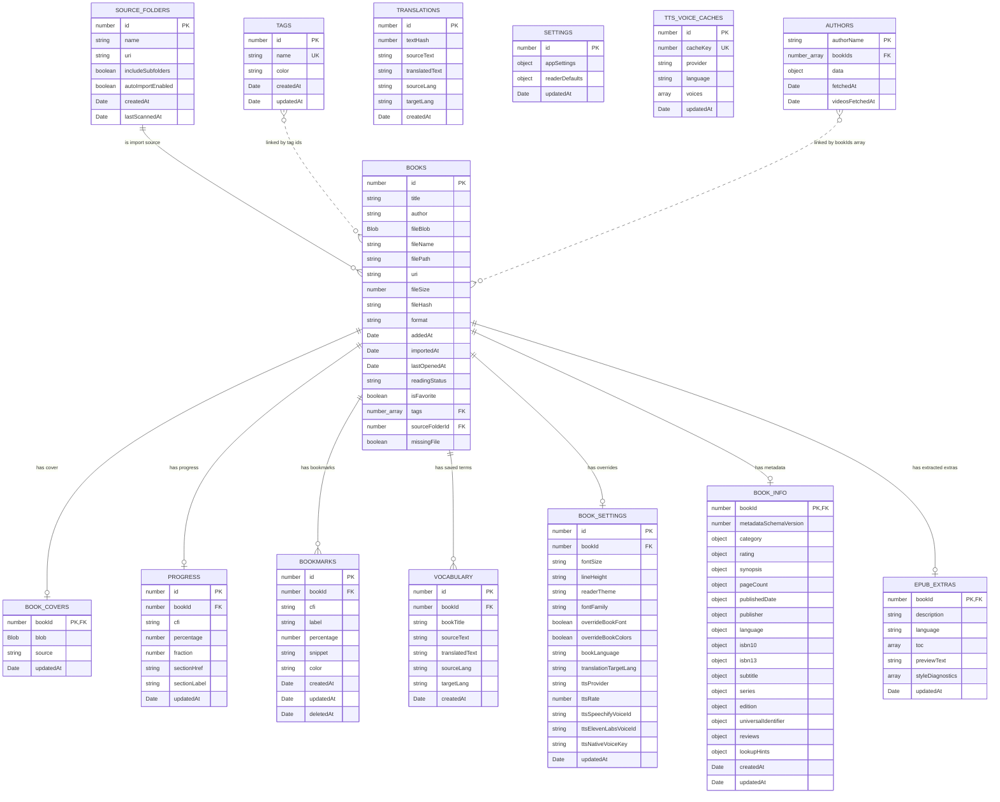

# Persistence audit

NeoReader persists durable user data in IndexedDB through Dexie. A few browser or
SDK-owned values live outside IndexedDB, and transient UI/runtime state remains in
memory by design.

## Persisted in IndexedDB

- `books`: book metadata, imported EPUB `fileBlob`, file/import metadata and tag links.
- `tags`: user-created library tags.
- `sourceFolders`: folders selected as import sources.
- `bookCovers`: extracted or manually uploaded cover blobs.
- `progress`: current reading CFI, percentage, fraction and section metadata.
- `bookmarks`: user bookmarks, including soft-deleted rows.
- `vocabulary`: saved source text and translation pairs.
- `translations`: translation cache by text hash.
- `settings`: app API keys, translation target and reader defaults.
- `bookSettings`: per-book reader and TTS preferences.
- `ttsVoiceCaches`: compatible TTS voice option caches.
- `authors`: author data cache, linked to local books through `bookIds`.
- `bookInfo`: enriched bibliographic metadata with value, source and confidence.
- `epubExtras`: stable EPUB details extracted from the local file.

## IndexedDB schema diagram

Notes:

- Dexie indexes are declared in `src/db/database.ts`; the current schema is
  version 13.
- `authors.bookIds` and `books.tags` are multi-entry indexes, not physical join
  tables.
- Stable author fields do not expire automatically; only `authors.data.videos`
  uses `videosFetchedAt` with a 7-day TTL.
- `bookInfo` stores each bibliographic field as an object containing `value`,
  `source` and `confidence`.
- `ttsVoiceCaches` keeps compatible Speechify and ElevenLabs voices for 24h.
- `epubExtras` persists description, language, TOC, preview text and style
  diagnostics until the local book is deleted or the extras cache is invalidated.
- `settings`, `ttsVoiceCaches`, `authors.data`, `bookInfo` and `epubExtras`
  contain nested objects that are persisted as IndexedDB values, even when only
  top-level fields are indexed.

## Persisted outside IndexedDB

- `localStorage`: `neoreader:welcome-seen`.
- `localStorage`: NYT Discover list cache entries, with a 12-hour TTL per list.
- Firebase/Auth SDK persistence: signed-in session state.

## Not persisted by design

- Navigation stack, current route and temporary selected book/menu state.
- Open tabs, sheets, modals, expanded sections and search/filter text.
- Loading, validation and error states.
- Settings form input while the user is editing but has not saved.
- Book details diagnostics, refresh token, optimistic state and voice preview state.
- Live reader state in Zustand: current CFI, percentage, chapter label and TOC.
- Debounced progress that has not flushed yet.
- Reader chrome visibility and auto-hide timers.
- TTS playback state, current chunk/paragraph, fallback notices and sleep timer.
- Generated TTS audio blobs, object URLs and speech marks.
- DOM-only highlights for TTS, selected text and inline translation blocks.
- Inline translations unless the user saves them to vocabulary.
- Derived lists and summaries such as library groups, profile history and achievements.
- Service diagnostics and in-memory request caches.

## Current decision

Durable reading data, user preferences, saved vocabulary, stable author data,
EPUB extras, caches and bibliographic metadata are persisted. UI state, reader
runtime state, generated audio, temporary highlights and unsaved translations
remain temporary so the app does not restore stale interaction state after
restart.
